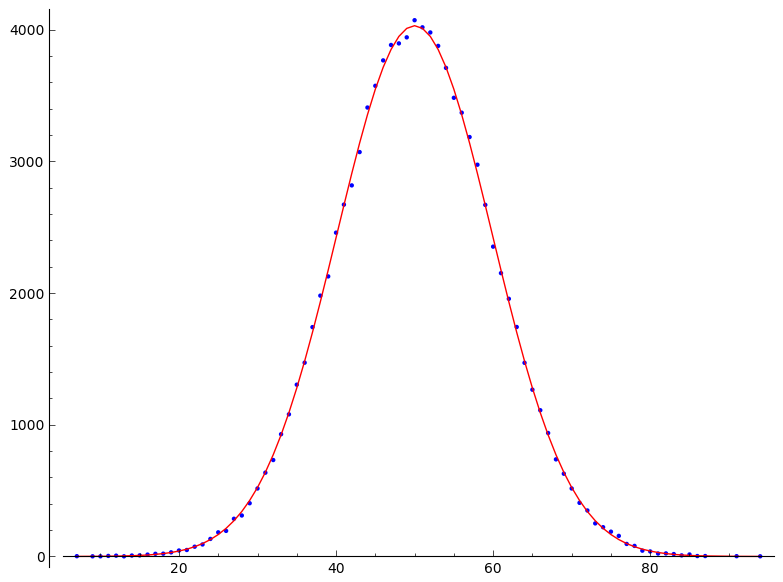

# Markov 
Markov is an optimized simulation tool written in C for arbitrary 
Reaction-Diffusion-Systems (RDS).

It simulates the Gillespie algorithm in the thermodynamical limit, 
and it has been proven [2] that there is no way to do a faster, 
exact simulation of the trajectory of the RDS.

A RDS is a lattice of reaction cells. The diffusion and reaction 
have to be chosen, that a diffusion step to a neighbour cell 
is much more probable than a reaction step in a cell.

The algorithm selects the next step by dividing the cells into reactivity 
classes based on the dual logarithm of the reaction probability.

This guarantees only a few classes and a relative homogeneous 
reaction probability inside the class, where a von-Neuman rejection 
algorithm is used to select a cell with an 75% efficiency.

Inside a cell standard Gillespie can be used.

First selecting the class, then the cell inside the class the 
algorithm has been proven to be the fastest method possible for
this class of problems.

1.  http://en.wikipedia.org/wiki/Gillespie_algorithm

2.  http://link.springer.com/article/10.1007/BF01309430#page-1

3.  http://www.worldscientific.com/doi/abs/10.1142/S0129183195000216

### Requirements

You need a full download of Sage http://sagemath.org/ to run this example.
You also need some development tools be active, like gcc. I have run this 
on Ubuntu 12.04.4, and it should run out of the box.

# Code

I have split the simulation into the random generator, the standard algorithm, 
the sage glue code and the domain specific code.

### pseudo random generator:

-    createtable.c
-    gauss55.h
-    rand55.h 
-    random55.h 
-    rand55.c
-    rand55static.c

### Common Algorithm

-    logclass.c 
-    logclass.h
-    logclassevent.h
-    logclasstest.c

This was the algorithm I developed for my diploma thesis in 1988-1989

### Glue Code to Sage

-   sagemarkov.h
-   sagemarkov.c
-   markovian.spyx

### Model Specific

The first example is a simple 1-dimensional random walk without reactions
-   model.h
-   randomwalk.h

### Usage

call sage from anywhere, the following example also works from the 
notebook() in a browser


```python
%sage
Sage Version 6.1.1, Release Date: 2014-02-04

sage: os.curdir='/path/to/your/sage-markov' 
sage: load_attach_path(os.curdir) 

sage: %attach "markovian.spyx"
# no '%' sign in the notebook()
Compiling ./markovian.spyx...
100 cells empty initialized

sage:m.plot()+m.analytic_plot()
```


